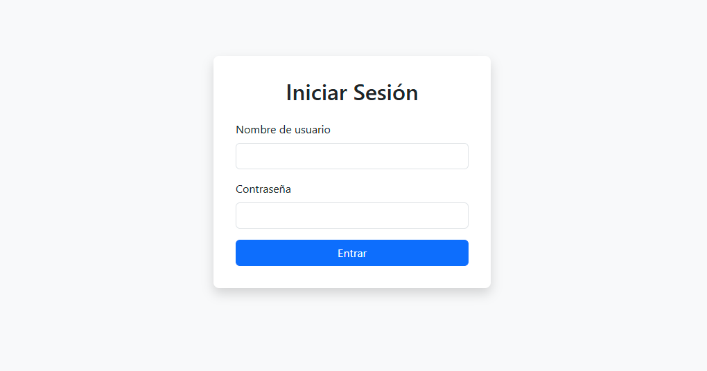
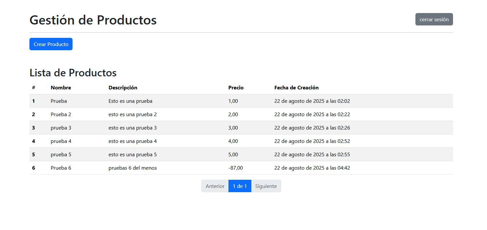
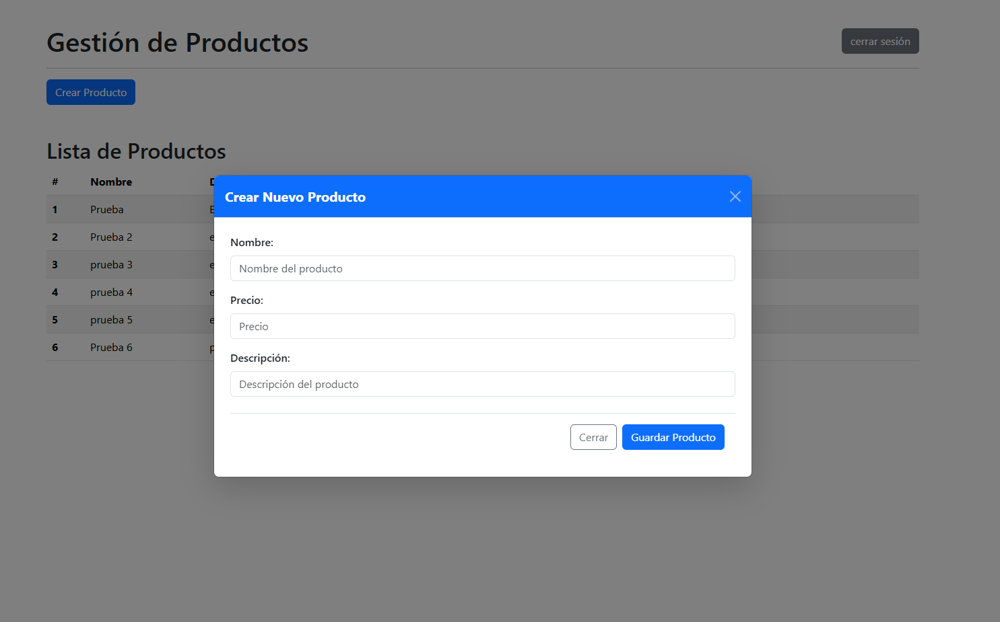
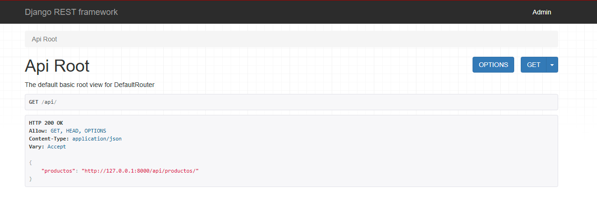
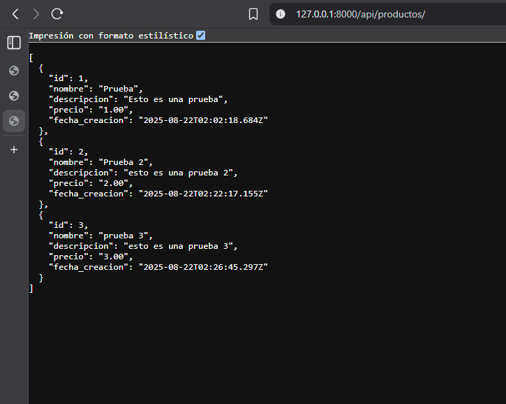

# 📦 Aplicación de Inventario - Django

Este proyecto es una aplicación básica de **inventario** desarrollada en **Django**.  
A continuación se describen los pasos necesarios para ponerla en funcionamiento en un entorno local.

---
```bash
## 🔹 1. Crear el entorno virtual

Se recomienda usar `venv` para crear un entorno virtual aislado:

# Crear el entorno virtual
python -m venv venv

# Activar el entorno virtual
# En Windows
venv\Scripts\activate

# En Linux / Mac
source venv/bin/activate
```

---

## 🔹 2. Instalar los requirements

Dentro del entorno virtual, instala las dependencias necesarias con:

```bash
pip install -r requirements.txt
```

---

## 🔹 3. Aplicar las migraciones

Ejecuta las migraciones de la base de datos:

```bash
python manage.py makemigrations
python manage.py migrate
```

---

## 🔹 4. Crear usuario administrador

Crea un usuario administrador para acceder a la **login de la aplicacion**:

```bash
python manage.py createsuperuser --username admin --email admin@example.com
```

Cuando te pida la contraseña, escribe:  

```
admin
```

---

✅ Ahora ya puedes iniciar el servidor con:

```bash
python manage.py runserver
```

Accede al login de la aplicacion:
👉 http://127.0.0.1:8000

Con las credenciales:  
- **Usuario:** `admin`  
- **Contraseña:** `admin`

---

A la aplicacion solo se puede ingresar con un usuario creado en django 



dentro de la palicacion veras lo siguiente



AL presionar el boton agregar producto se abre un modal con el formulario para agregar producto



Adicional se encuentra el boton para cerrar sesion


Se crea con api_Rest framework el siguiente endpoint [local](http://127.0.0.1:8000/api/productos/)






Se agregan test para el proyecto que se pueden ejecutar en la terminal con pytest


# ✅ Requerimientos del Proyecto

Este proyecto se basa en Django y tiene como objetivo implementar una aplicación de inventario con autenticación, vistas y API REST.

---

## 📌 Configuración inicial
- [X] Crear un proyecto **Django** llamado `prueba_django`.
- [X] Crear una aplicación llamada `inventario`.

---

## 📌 Modelo de datos
- [X] Crear modelo **Producto** con los siguientes campos:
  - [X] `nombre` (texto, único).
  - [X] `descripción` (texto).
  - [X] `precio` (decimal, 2 decimales).
  - [X] `fecha_creacion` (auto, fecha de creación).

---

## 📌 Autenticación
- [X] Configurar **login** y **logout** usando usuarios de Django.
- [X] Restringir que **solo usuarios autenticados** puedan:
  - [X] Crear productos.
  - [X] Ver listado de productos.

---

## 📌 Vistas / Templates
- [X] Página de **inicio** con:
  - [X] Tabla con productos existentes.
  - [X] Formulario para agregar un nuevo producto.
  - [X] Botón de **logout**.

---

## 📌 API REST
- [X] Crear endpoint `/api/productos/` que:
  - [X] Devuelva productos en formato **JSON**.
  - [X] Esté protegido con autenticación.
  - [X] Use **Django Rest Framework**.

---

## 📌 Extras (puntos adicionales)
- [X] Validar que el **precio** sea siempre positivo.
- [X] Agregar **paginación** en el listado de productos.
- [X] Mejorar la API con **DRF** (serializers, viewsets, etc.).

---

# 📦 Entregables

Estos son los entregables requeridos para el proyecto:

- [x] Código fuente en un repositorio (**GitHub/GitLab**).
- [x] Archivo **README.md** con instrucciones para ejecutar el proyecto.
- [x] Incluir las **dependencias, migraciones, usuario de prueba y ejecución del servidor**
